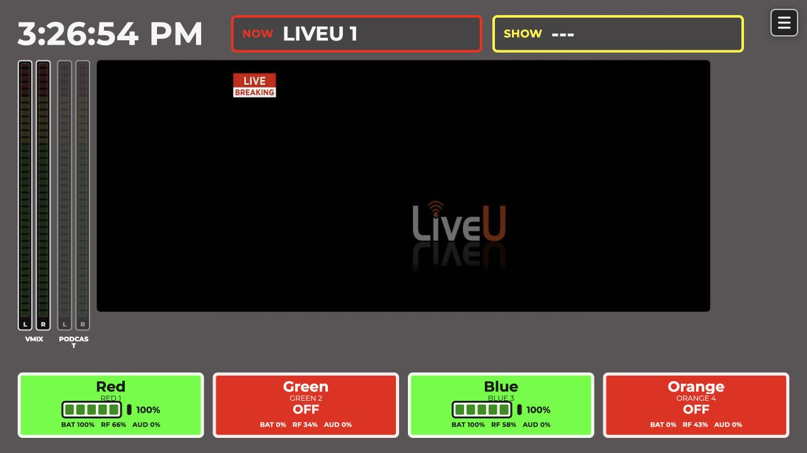
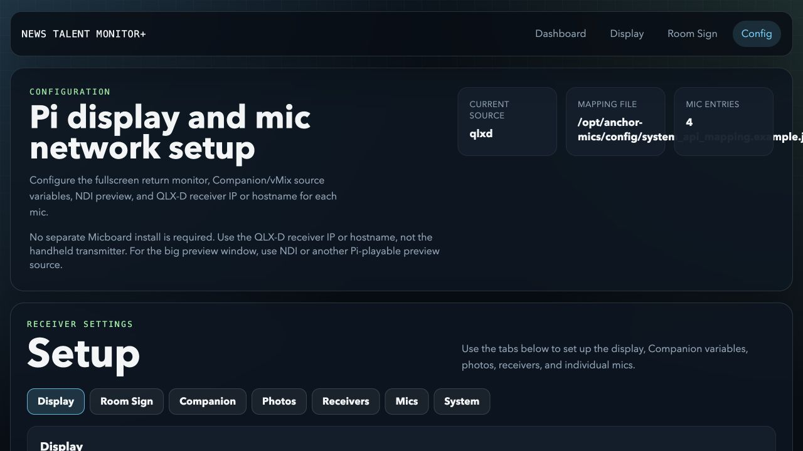
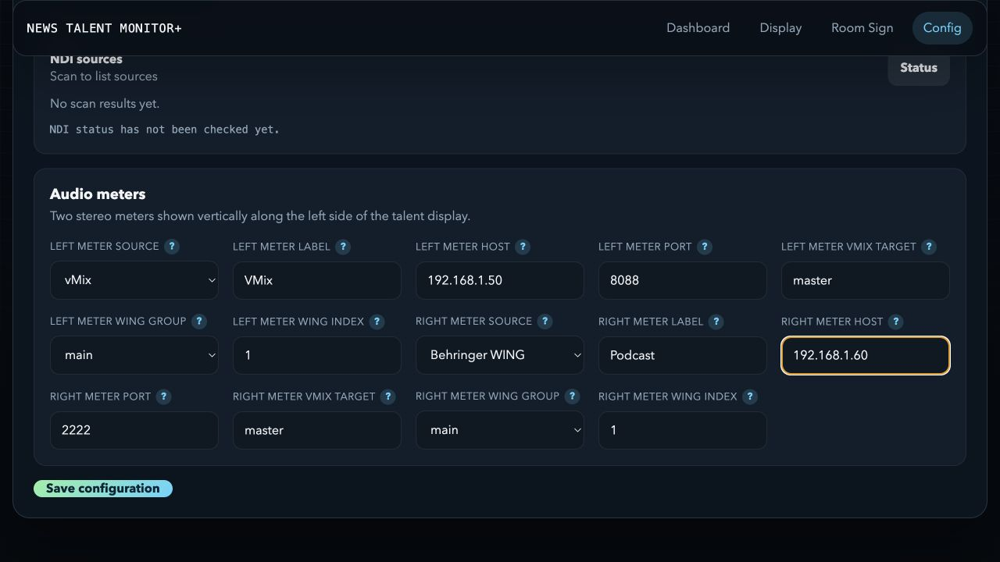
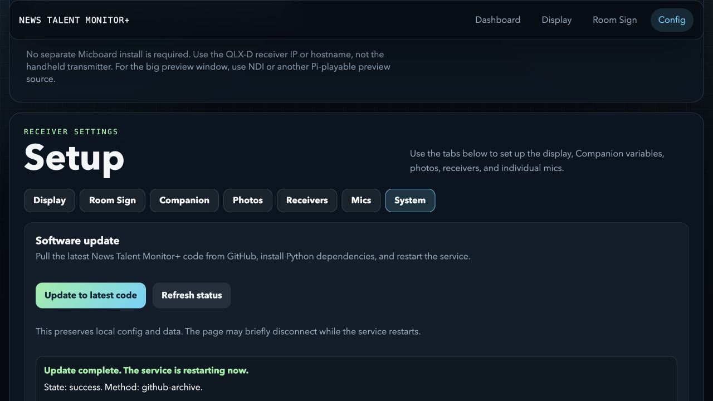

# News Talent Monitor+

Wouldn't it be better if the monitor on the front of your camera showed more than just return video?

News Talent Monitor+ turns a Raspberry Pi into a front-of-camera talent monitor for newsrooms and studio production teams. It shows return video, current PGM, upcoming PVW, configurable stereo audio meters, talent mic assignments, headshots, and Shure wireless mic status in one screen.



## Start Here

The easiest install path is the normal program installer for your operating system:

```text
NewsTalentMonitorPlus-Setup.exe
Install News Talent Monitor.command
```

Raspberry Pi OS with Desktop can be installed from Terminal with:

```bash
curl -fsSL https://raw.githubusercontent.com/wtapper89/NewsTalentMonitorPlus/main/install-pi.sh | bash
```

Installer docs:

```text
installers/windows/README.md
installers/macos/README.md
installers/raspberry-pi/README.md
```

These installers do not bundle the NDI SDK/runtime. They check for NDI and point you to the official NDI download if it is missing.

The older custom Pi image guide is still available here:

```text
docs/START_HERE.md
```

The install-as-a-program design notes are here:

```text
docs/INSTALL_AS_PROGRAM.md
```

## What It Shows

- Large return video from an NDI source
- Green `Now` box for the current PGM source
- Yellow `Next` box for the current PVW source
- Two configurable stereo audio meters with fixed green, yellow, and red level zones
- vMix master, bus, or input metering
- Behringer WING channel, aux, bus, main, matrix, or DCA metering
- Mic assignment tiles for anchors, hosts, reporters, or guests
- Optional headshot beside each assigned person
- Battery, RF, audio level, and online/offline state for each mic
- Hamburger button for quick setup access

## Daily Use

1. Power on the Raspberry Pi.
2. Wait for the fullscreen monitor page to open.
3. Confirm the large preview is showing the expected vMix NDI output.
4. Confirm `Now` and `Next` match vMix PGM/PVW.
5. Check the mic boxes:
   - Green means the mic is online and healthy.
   - Yellow means something needs attention.
   - Red means the mic or transmitter is unavailable.
6. Confirm the stereo meters respond to the expected audio sources.
7. Tap the hamburger button in the upper-right corner to open setup.

## Important Links

- Raspberry Pi Imager: https://www.raspberrypi.com/software/
- NDI SDK: https://ndi.video/for-developers/ndi-sdk/download/
- Docker Desktop: https://www.docker.com/products/docker-desktop/
- NDI SDK licensing: https://docs.ndi.video/all/developing-with-ndi/sdk/licensing

## Config Page

After the Pi boots, open:

```text
http://<pi-ip-address>:8010/config
```



The config page has these tabs:

- `Display`: choose the NDI source, configure the Now/Next boxes, and set up the two audio meters.
- `Room Sign`: configure the optional room-sign display.
- `Companion`: enter the Companion URL and PGM/PVW variables.
- `Photos`: enter the photo-folder URL.
- `Receivers`: keep the QLX-D defaults unless your receivers use different settings.
- `Mics`: enter each Shure receiver IP and optional Companion assignment variable.
- `System`: install the latest version from GitHub without replacing local configuration.

After changing a setting, select `Save configuration` at the bottom of the page.

## Audio Meter Setup

The talent display supports two independently configurable stereo meters. Either position can use vMix, a Behringer WING, or be turned off.



Open the `Display` tab and scroll to `Audio meters`. For each meter, set:

- `Source`: `vMix`, `Behringer WING`, or `Off`.
- `Label`: the short name shown below the meter.
- `Host`: the device IP address or hostname.
- `Port`: `8088` for the vMix Web API or `2222` for WING native metering.

For vMix, set `vMix target` to one of the following:

- `master`
- `busA` through `busG`
- An input number, exact input title, or input key

For WING, choose the meter group (`main`, `bus`, `channel`, `aux`, `matrix`, or `dca`) and its one-based index. For example, WING master is `main` with index `1`.

The Pi must be able to reach the selected audio device over the network. If a meter is dim and does not move, verify its host, port, group/target, and network access.

## Updating An Installed Device

Open `http://<pi-ip-address>:8010/config`, select `System`, and choose `Update to latest code`. The updater downloads the latest public GitHub version, installs any changed Python dependencies, preserves local configuration and data, and restarts the service.



Wait for `State: success`. The page may disconnect briefly while the service restarts. Refresh the display afterward if the browser has not reloaded automatically.

## Legal And Licensing Notes

News Talent Monitor+ does not include the NDI SDK or NDI runtime in this source repository.

Native NDI preview support dynamically loads `libndi.so` from an NDI SDK/runtime installation. If you use the custom Pi image builder to embed the NDI runtime, you must provide the NDI SDK archive yourself and explicitly confirm that you accept the NDI SDK license.

Product names and trademarks belong to their respective owners. This project is not affiliated with, endorsed by, or sponsored by NDI, vMix, Bitfocus Companion, Shure, Raspberry Pi, or any related company.

See `LICENSE` and `THIRD_PARTY_NOTICES.md` for project license and attribution details.

## Credits

- Micboard by Karl Swanson: https://github.com/karlcswanson/micboard
- Raspberry Pi pi-gen: https://github.com/RPi-Distro/pi-gen
- Bitfocus Companion: https://bitfocus.io/companion
- FastAPI: https://fastapi.tiangolo.com/
- NDI SDK documentation: https://docs.ndi.video/

## More Docs

- [First-time setup](docs/START_HERE.md)
- [Windows photo/server notes](docs/WINDOWS_SETUP.md)
- [Image builder details](deploy/pi-image/README.md)
- [Raspberry Pi services](deploy/raspberry-pi/README.md)

## Developer Notes

The repository and service names still use `anchor-mics` internally in a few places for compatibility with existing installs and systemd services. The user-facing product name is News Talent Monitor+.

Run locally:

```bash
python3 -m venv .venv
. .venv/bin/activate
pip install -r requirements.txt
python run.py
```

Run tests:

```bash
python3 -m unittest discover -s tests
```
